# Execution Plan

## Detailed Analysis Summary

### Change Impact Assessment
- **User-facing changes**: Yes - 고객 주문 앱, 관리자 대시보드 전체 신규 개발
- **Structural changes**: Yes - 전체 시스템 아키텍처 신규 설계 (프론트엔드 2개 + 백엔드 + DB)
- **Data model changes**: Yes - 전체 데이터 모델 신규 설계 (9개 핵심 엔티티)
- **API changes**: Yes - 전체 REST API 신규 설계 + SSE 엔드포인트
- **NFR impact**: Yes - 보안(JWT, bcrypt), 성능(SSE 2초 이내), AWS 인프라

### Risk Assessment
- **Risk Level**: Medium (신규 프로젝트이므로 기존 시스템 영향 없음, 다만 복잡도 높음)
- **Rollback Complexity**: Easy (Greenfield)
- **Testing Complexity**: Complex (다중 앱, 실시간 통신, 인증, 다중 매장)

## Workflow Visualization

```mermaid
flowchart TD
    Start(["User Request"])
    
    subgraph INCEPTION["🔵 INCEPTION PHASE"]
        WD["Workspace Detection<br/><b>COMPLETED</b>"]
        RA["Requirements Analysis<br/><b>COMPLETED</b>"]
        US["User Stories<br/><b>COMPLETED</b>"]
        WP["Workflow Planning<br/><b>COMPLETED</b>"]
        AD["Application Design<br/><b>EXECUTE</b>"]
        UG["Units Generation<br/><b>EXECUTE</b>"]
    end
    
    subgraph CONSTRUCTION["🟢 CONSTRUCTION PHASE"]
        FD["Functional Design<br/><b>EXECUTE</b><br/>(per-unit)"]
        NFRA["NFR Requirements<br/><b>EXECUTE</b><br/>(per-unit)"]
        NFRD["NFR Design<br/><b>EXECUTE</b><br/>(per-unit)"]
        ID["Infrastructure Design<br/><b>EXECUTE</b><br/>(per-unit)"]
        CG["Code Generation<br/><b>EXECUTE</b><br/>(per-unit)"]
        BT["Build and Test<br/><b>EXECUTE</b>"]
    end
    
    Start --> WD
    WD --> RA
    RA --> US
    US --> WP
    WP --> AD
    AD --> UG
    UG --> FD
    FD --> NFRA
    NFRA --> NFRD
    NFRD --> ID
    ID --> CG
    CG -.->|Next Unit| FD
    CG --> BT
    BT --> End(["Complete"])
    
    style WD fill:#4CAF50,stroke:#1B5E20,stroke-width:3px,color:#fff
    style RA fill:#4CAF50,stroke:#1B5E20,stroke-width:3px,color:#fff
    style US fill:#4CAF50,stroke:#1B5E20,stroke-width:3px,color:#fff
    style WP fill:#4CAF50,stroke:#1B5E20,stroke-width:3px,color:#fff
    style AD fill:#FFA726,stroke:#E65100,stroke-width:3px,stroke-dasharray: 5 5,color:#000
    style UG fill:#FFA726,stroke:#E65100,stroke-width:3px,stroke-dasharray: 5 5,color:#000
    style FD fill:#FFA726,stroke:#E65100,stroke-width:3px,stroke-dasharray: 5 5,color:#000
    style NFRA fill:#FFA726,stroke:#E65100,stroke-width:3px,stroke-dasharray: 5 5,color:#000
    style NFRD fill:#FFA726,stroke:#E65100,stroke-width:3px,stroke-dasharray: 5 5,color:#000
    style ID fill:#FFA726,stroke:#E65100,stroke-width:3px,stroke-dasharray: 5 5,color:#000
    style CG fill:#4CAF50,stroke:#1B5E20,stroke-width:3px,color:#fff
    style BT fill:#4CAF50,stroke:#1B5E20,stroke-width:3px,color:#fff
    style INCEPTION fill:#BBDEFB,stroke:#1565C0,stroke-width:3px,color:#000
    style CONSTRUCTION fill:#C8E6C9,stroke:#2E7D32,stroke-width:3px,color:#000
    style Start fill:#CE93D8,stroke:#6A1B9A,stroke-width:3px,color:#000
    style End fill:#CE93D8,stroke:#6A1B9A,stroke-width:3px,color:#000
    linkStyle default stroke:#333,stroke-width:2px
```



### Text Alternative
```
Phase 1: INCEPTION
  - Workspace Detection (COMPLETED)
  - Requirements Analysis (COMPLETED)
  - User Stories (COMPLETED)
  - Workflow Planning (COMPLETED)
  - Application Design (EXECUTE)
  - Units Generation (EXECUTE)

Phase 2: CONSTRUCTION (per-unit loop)
  - Functional Design (EXECUTE, per-unit)
  - NFR Requirements (EXECUTE, per-unit)
  - NFR Design (EXECUTE, per-unit)
  - Infrastructure Design (EXECUTE, per-unit)
  - Code Generation (EXECUTE, per-unit)
  - Build and Test (EXECUTE, after all units)
```

## Phases to Execute

### 🔵 INCEPTION PHASE
- [x] Workspace Detection (COMPLETED)
- [x] Requirements Analysis (COMPLETED)
- [x] User Stories (COMPLETED)
- [x] Workflow Planning (COMPLETED)
- [ ] Application Design - EXECUTE
  - **Rationale**: 신규 시스템으로 컴포넌트 식별, 서비스 레이어 설계, 컴포넌트 간 의존성 정의 필요
- [ ] Units Generation - EXECUTE
  - **Rationale**: 3개 앱(Customer Frontend, Admin Frontend, Backend API) + DB + 인프라로 분해 필요

### 🟢 CONSTRUCTION PHASE (per-unit)
- [ ] Functional Design - EXECUTE
  - **Rationale**: 각 유닛별 데이터 모델, 비즈니스 로직, API 엔드포인트 상세 설계 필요
- [ ] NFR Requirements - EXECUTE
  - **Rationale**: 보안(SECURITY-01~15), 성능(SSE), PBT(PBT-01~10) 요구사항 정의 필요
- [ ] NFR Design - EXECUTE
  - **Rationale**: NFR 패턴을 각 유닛에 적용하는 설계 필요
- [ ] Infrastructure Design - EXECUTE
  - **Rationale**: AWS 클라우드 배포를 위한 인프라 서비스 매핑 필요
- [ ] Code Generation - EXECUTE (ALWAYS)
  - **Rationale**: 각 유닛별 코드 생성
- [ ] Build and Test - EXECUTE (ALWAYS)
  - **Rationale**: 전체 빌드 및 테스트 지침 생성

### Skipped Stages
- Reverse Engineering - SKIP (Greenfield 프로젝트)

## Success Criteria
- **Primary Goal**: 테이블 오더 시스템 MVP 완성
- **Key Deliverables**: Customer App, Admin App, Backend API, DB Schema, AWS 인프라 설계
- **Quality Gates**: Security Extension 준수, PBT Extension 준수, 모든 수용 기준 충족
